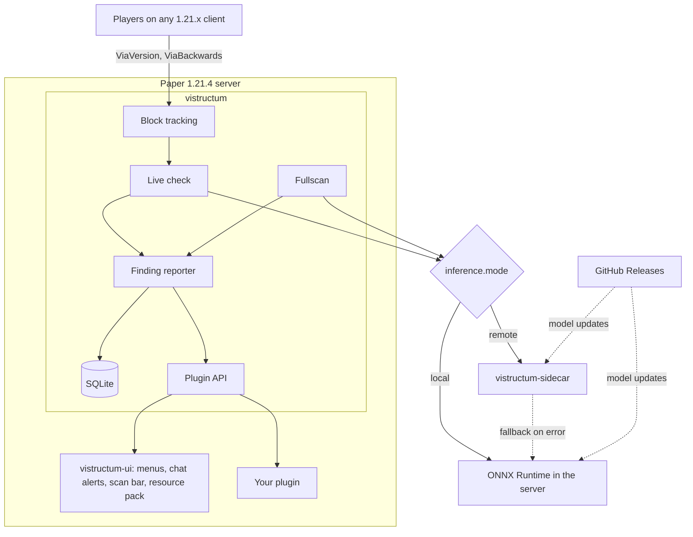

<p align="center">
  
</p>

<p align="center">
  Detects swastikas that players build from blocks on Paper servers and reports them to staff for review.
</p>

<p align="center">
  <a href="https://github.com/KyleKreuter/vistructum/actions/workflows/build.yml"></a>
  <a href="LICENSE"></a>
  
  
</p>

## What it does

Vistructum watches block changes and scans world surfaces with two small neural networks. When it finds a swastika, it stores a **finding** and alerts staff in chat. Staff review the finding in a menu and mark it as confirmed or as a false alarm.

Vistructum never kicks, bans, or rolls back on its own. Every decision stays with your staff.

## Features

- **Live check:** Detects symbols shortly after players finish building them, including rotated, mirrored, irregular, and carved variants from 5×5 blocks upward.
- **Fullscan:** Scans the surface of whole worlds daily or on demand, with a progress bar for staff.
- **Review menu:** Lists open findings with preview images. The detail view shows the scene, the builder's face, location, probability, and source.
- **Chat alerts:** Staff get a message with **[Open]** and **[TP]** buttons for every new finding.
- **Local or remote inference:** Runs the models inside the server process, or on a separate sidecar with a local fallback.
- **Model updates:** Downloads new models from GitHub Releases automatically.
- **Plugin API:** Query findings, submit reviews, start scans, and listen to events from your own plugin.
- **Stateless design:** All state lives in SQLite. After a restart, running scans continue where they stopped.

## How it works



- **Live check:** The core records every placed and broken block in SQLite. Every few seconds it groups nearby changes into clusters. A cluster that has been quiet for `tracking.quiet-seconds` becomes a mask and goes to the mask model.
- **Fullscan:** The scanner walks the world in 256×256 tiles, samples the surface height and brightness, and sends each tile to the fullscan model.
- **Findings:** Both paths hand detections to the same reporter. It removes duplicates, fires `FindingCreateEvent`, stores the finding, and fires `FindingCreatedEvent`.
- **UI:** `vistructum-ui` uses only the public API. You can replace it with your own plugin.

## Requirements

- Paper 1.21.4
- Java 21
- ViaVersion and ViaBackwards, if players join with other 1.21.x clients

## Installation

### Plugin jars

1. Download `vistructum-<version>.jar` and `vistructum-ui-<version>.jar` from [Releases](https://github.com/KyleKreuter/vistructum/releases).
2. Copy both jars into `plugins/`.
3. Set `pack.public-url` in `plugins/vistructum-ui/config.yml` to an address your players can reach. The default `http://localhost:8765/pack.zip` works only on the machine that runs the server.
4. Restart the server.

On the first start, Paper downloads SQLite JDBC and ONNX Runtime through the `libraries` entry in `plugin.yml`.

### Docker Compose

```bash
docker compose build
docker compose up -d server
```

The `server` service runs Paper 1.21.4 with both plugins, ViaVersion, and ViaBackwards. It exposes port 25565 for players and port 8765 for the resource pack.

To run inference on a separate container, start the sidecar and set `inference.mode: remote`:

```bash
docker compose up -d sidecar
```

## Commands and permissions

| Command | Description |
|---|---|
| `/vis`, `/vis review [count]` | Opens the review list |
| `/vis show <id>` | Opens a finding |
| `/vis status` | Shows the inference mode, loaded models, tracked changes, open findings, and running scans |
| `/vis tp <id>` | Teleports to a finding |
| `/vis confirm <id>` | Marks a finding as confirmed |
| `/vis falsealarm <id>` | Marks a finding as a false alarm |
| `/vis scan [world\|stop]` | Starts a fullscan or stops all scans |

| Permission | Default | Grants |
|---|---|---|
| `vistructum.staff` | op | Chat alerts, list, detail view, and reviews |
| `vistructum.admin` | op | `vistructum.staff` and `/vis scan` |

## Configuration

| File | Content |
|---|---|
| `plugins/vistructum/config.yml` | Inference mode, model updates, sidecar address, live check timing, daily fullscan |
| `plugins/vistructum-ui/config.yml` | Resource pack port and public URL, map previews in the list |
| `plugins/vistructum-ui/messages.yml` | All chat and menu texts in MiniMessage format |

The [Configuration](https://github.com/KyleKreuter/vistructum/wiki/Configuration) wiki page describes every key.

## Plugin API

Add `vistructum-api` as a `provided` dependency and declare `depend: [vistructum]` in your `plugin.yml`.

```java
Vistructum.get().findings()
        .find(FindingQuery.open().world("world").limit(10))
        .thenAccept(page -> page.items().forEach(finding -> staff.sendMessage("#" + finding.id())));
```

Every future completes on the main thread. The [Plugin API](https://github.com/KyleKreuter/vistructum/wiki/Plugin-API) wiki page covers setup, threading, and events.

## Building

```bash
mvn package
```

| Module | Output |
|---|---|
| `vistructum-api` | Public API, bundled into the core jar |
| `vistructum-inference` | Model inference shared by the core and the sidecar |
| `vistructum-core` | `vistructum-core/target/vistructum-<version>.jar` |
| `vistructum-ui` | `vistructum-ui/target/vistructum-ui-<version>.jar` |
| `vistructum-sidecar` | `vistructum-sidecar/target/vistructum-sidecar.jar` |

`ml/` contains model training and the Python reference implementation. The plugins don't need Python at runtime. See [Building](https://github.com/KyleKreuter/vistructum/wiki/Building) for details.

## Contributing

Read [Contributing](https://github.com/KyleKreuter/vistructum/wiki/Contributing) before you open a pull request.

## License

Vistructum is licensed under the [GNU General Public License v3.0](LICENSE). You can use it on any server, including commercial ones. If you distribute a modified version, you must publish its source code under the same license.
