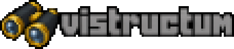
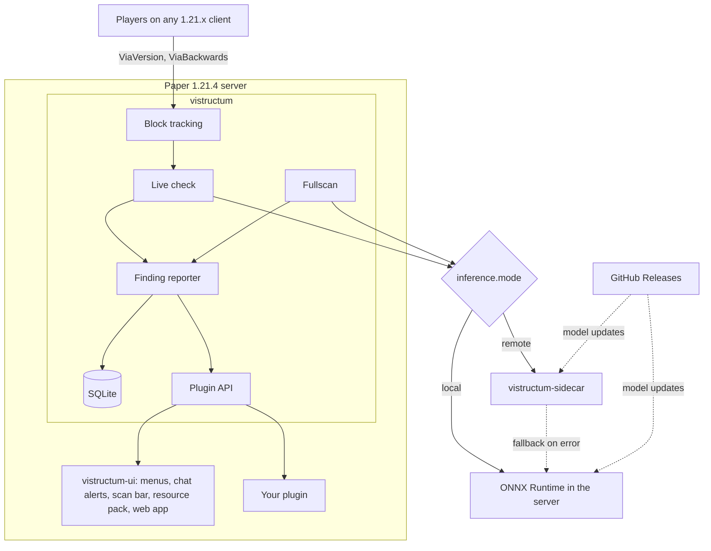

<p align="center">
  
</p>

<p align="center">
  Detects swastikas that players build from blocks on Paper servers and reports them to staff for review.
</p>

<p align="center">
  <a href="https://github.com/KyleKreuter/vistructum/actions/workflows/build.yml"></a>
  <a href="LICENSE"></a>
  
  
</p>

## What it does

Vistructum watches block changes and scans whole worlds with two small neural networks. When it finds a swastika, it stores a **finding** and alerts staff in chat. Staff review the finding in a menu and mark it as confirmed or as a false alarm.

Vistructum never kicks, bans, or rolls back on its own. Every decision stays with your staff.

## Features

- **Live check:** Detects symbols shortly after players finish building them, including rotated, mirrored, irregular, and carved variants from 5×5 blocks upward.
- **Fullscan:** Scans whole worlds daily or on demand, including the Nether and the End, with a progress bar for staff. It checks the surface and also finds symbols built underground or hidden inside terrain.
- **Review menu:** Lists open findings with preview images. The detail view shows the scene, the builder's face, location, probability, and source.
- **Chat alerts:** Staff get a message with **[Open]** and **[TP]** buttons for every new finding.
- **Review web app (optional):** Staff sign in with a one-time link from `/vis web` and review findings in the browser: filtered list, scene with model heatmap, 3D view of full scan findings, 3D replay of recorded builds, statistics, status, and an activity log. Off by default.
- **Evidence recording (optional):** Records player movement for a few minutes and secures the build, the blocks before it, and the nearby players as a replay when the live check creates a finding. Off by default.
- **Public evidence links (optional):** Share the replay of a confirmed finding through a link without coordinates or world name, and deactivate it at any time.
- **Local or remote inference:** Runs the models inside the server process, or on a separate sidecar with a local fallback.
- **Update notices:** Checks GitHub Releases daily and logs when a new plugin version or model is available. New models install automatically only after you set `updates.auto-update-models: true` (`MODELS_AUTO_UPDATE=true` for the sidecar).
- **Plugin API:** Query findings, submit reviews, start scans, and listen to events from your own plugin.
- **Stateless design:** All state lives in SQLite. After a restart, running scans continue where they stopped.

## How it works


```mermaid
flowchart TB
    players["Players on any 1.21.x client"] -->|"ViaVersion, ViaBackwards"| tracking

    subgraph server["Paper 1.21.4 server"]
        subgraph core["vistructum"]
            tracking["Block tracking"] --> live["Live check"]
            fullscan["Fullscan"]
            live --> reporter["Finding reporter"]
            fullscan --> reporter
            reporter --> db[("SQLite")]
            reporter --> api["Plugin API"]
        end
        api --> ui["vistructum-ui: menus, chat alerts, scan bar, resource pack, web app"]
        api --> yours["Your plugin"]
    end

    live --> inference{"inference.mode"}
    fullscan --> inference
    inference -->|local| onnx["ONNX Runtime in the server"]
    inference -->|remote| sidecar["vistructum-sidecar"]
    sidecar -.->|"fallback on error"| onnx
    releases["GitHub Releases"] -.->|"model updates"| onnx
    releases -.->|"model updates"| sidecar
```

- **Live check:** The core records every placed and broken block in SQLite. Every few seconds it groups nearby changes into clusters. A cluster that has been quiet for `tracking.quiet-seconds` becomes a mask and goes to the mask model.
- **Fullscan:** The scanner reads the region files directly, without loading chunks on the server, and walks the world in 256×256 tiles. For each tile, it runs two checks:
  - **Surface:** Samples the surface height and brightness and sends the tile to the fullscan model.
  - **Volume:** Finds clusters of blocks that are rare in their surroundings, keeps the flat or evenly extruded ones, and sends their outlines to the mask model.
- **Findings:** Both paths hand detections to the same reporter. It removes duplicates, fires `FindingCreateEvent`, stores the finding, and fires `FindingCreatedEvent`.
- **UI:** `vistructum-ui` uses only the public API. You can replace it with your own plugin.

## Requirements

- Paper 1.21.4
- Java 21
- ViaVersion and ViaBackwards, if players join with other 1.21.x clients

## Installation

### Plugin jars

1. Download `vistructum-<version>.jar` and `vistructum-ui-<version>.jar` from [Releases](https://github.com/KyleKreuter/vistructum/releases).
2. Copy both jars into `plugins/`.
3. Set `pack.public-url` in `plugins/vistructum-ui/config.yml` to an address your players can reach. The default `http://localhost:8765/pack.zip` works only on the machine that runs the server.
4. Restart the server.

On the first start, Paper downloads SQLite JDBC and ONNX Runtime through the `libraries` entry in `plugin.yml`.

### Docker Compose

```bash
docker compose build
docker compose up -d server
```

The `server` service runs Paper 1.21.4 with both plugins, ViaVersion, and ViaBackwards. It exposes port 25565 for players and port 8765 for the resource pack and, once enabled, the web app.

To run inference on a separate container, start the sidecar and set `inference.mode: remote`:

```bash
docker compose up -d sidecar
```

## Commands and permissions

| Command | Description |
|---|---|
| `/vis`, `/vis review [count]` | Opens the review list |
| `/vis show <id>` | Opens a finding |
| `/vis status` | Shows the inference mode, loaded models, tracked changes, open findings, and running scans |
| `/vis tp <id>` | Teleports to a finding |
| `/vis confirm <id>` | Marks a finding as confirmed |
| `/vis falsealarm <id>` | Marks a finding as a false alarm |
| `/vis stats` | Shows the precision per source: confirmed findings divided by all reviewed findings |
| `/vis scan [world\|stop]` | Starts a fullscan or stops all scans |
| `/vis export` | Exports all reviewed findings as training data to `plugins/vistructum/exports/` |
| `/vis web` | Sends a one-time sign-in link to the web app, valid for 5 minutes |
| `/vis evidence <id>` | Sends a sign-in link that opens the replay of a finding |
| `/vis evidence <id> share` | Activates the public evidence link of a confirmed finding with evidence |
| `/vis evidence <id> unshare` | Deactivates the public evidence link |

| Permission | Default | Grants |
|---|---|---|
| `vistructum.staff` | op | Chat alerts, list, detail view, reviews, `/vis stats`, and sign-in to the web app |
| `vistructum.admin` | op | `vistructum.staff`, `/vis scan`, and `/vis export` |
| `vistructum.evidence.share` | op | Activates and deactivates public evidence links. Not included in `vistructum.admin` |

`/vis export` writes one `<kind>.jsonl` file per model kind with the model input scene, the detection window, and the verdict of each reviewed finding. Retention deletes false alarms after `retention.reviewed-days` and confirmed findings after `retention.confirmed-days`, so export them before. Convert a file into a training split with `python ml/train/findings.py mask.jsonl --out <data-dir>`; run it with `ml` and `ml/train` on `PYTHONPATH`.

## Configuration

| File | Content |
|---|---|
| `plugins/vistructum/config.yml` | Inference mode, update checks, sidecar address, live check timing, evidence recording, daily fullscan worlds and scan threads, retention |
| `plugins/vistructum-ui/config.yml` | Resource pack and web app port, public URLs, web app switch, texture download, map previews in the list |
| `plugins/vistructum-ui/messages.yml` | All chat and menu texts in MiniMessage format |

The [Configuration](https://github.com/KyleKreuter/vistructum/wiki/Configuration) wiki page describes every key.

## Web app and evidence recording

Both features are off by default and independent of each other. Restart the server after you change them.

### Turn on the web app

1. In `plugins/vistructum-ui/config.yml`, set:

   ```yaml
   web:
     enabled: true
     bind-address: "0.0.0.0"
     public-url: "https://review.example.org"
   ```

   `public-url` is the address staff open in the browser, without the `/review` path. When it starts with `https`, session cookies get the `Secure` flag. The web app runs on `pack.bind-port` (default 8765), the same port as the resource pack. `bind-address` applies to both. `127.0.0.1` accepts only local connections, for example behind a reverse proxy that forwards `/review` unchanged.
2. Restart the server. The log shows `the web app is served on … and linked as …/review/`.
3. In game, run `/vis web` and click the link. The link works once and expires after 5 minutes. A session lasts 12 hours.

To show Minecraft block textures in the 3D views, also set `web.textures.download: true`. The plugin then downloads the client jar of the running version from Mojang and caches its block and item textures in `plugins/vistructum-ui/assets/`. Setting this key to `true` means you accept the [Minecraft EULA](https://aka.ms/MinecraftEULA). Without it, the web app draws its own simple textures.

### Turn off the web app

Set `web.enabled: false` and restart. The web app, its API, the sign-in links, `/vis web`, `/vis evidence`, and the **Evidence** button in the detail menu are gone. Port 8765 stays open on all interfaces for the resource pack. Stored data, including public links, remains in the database and works again when you turn the web app back on.

### Turn on evidence recording

In `plugins/vistructum/config.yml`, set:

```yaml
recording:
  enabled: true
  radius: 32
  lead-seconds: 30
  margin: 4
```

While recording is on, the core samples the position, pose, and held item of every online player each tick and keeps them for `tracking.ttl-minutes` plus `lead-seconds` (10.5 minutes by default). When the live check creates a finding, it secures a replay of the finding:

- the blocks inside the finding box plus `margin` blocks, as they were before the build
- every block change of the build, with player and time
- the movement of every player within `radius` blocks, starting `lead-seconds` before the first change

Full scan findings never get a replay, because they have no recent block changes.

### Turn off evidence recording

Set `recording.enabled: false` and restart. The core stops recording movement and secures no new evidence. The live check keeps tracking block changes, because detection needs them. New findings have no replay, and you can't share them. Evidence secured earlier stays until retention deletes its finding.

### Public evidence links

Holders of `vistructum.evidence.share` can share the replay of a **confirmed** finding with evidence, in the web app or with `/vis evidence <id> share`. The link has the form `<public-url>/review/e/<token>` and needs no sign-in. The page shows the replay, the date, and the verdict. It shows no world name and no absolute coordinates. The replay data contains the names and skins of the recorded players. `/vis evidence <id> unshare` deactivates the link. Activating it again restores the same URL.

## Usage statistics

Vistructum sends anonymous usage data to [bStats](https://bstats.org/plugin/bukkit/Vistructum/34300): server and player counts, the inference mode, the model update setting, whether the daily scan is on, the number of scan worlds, and whether `vistructum-ui` runs. It sends no findings, reviews, or player names. To turn this off for all plugins, set `enabled: false` in `plugins/bStats/config.yml`.

## Plugin API

Add `vistructum-api` as a `provided` dependency and declare `depend: [vistructum]` in your `plugin.yml`.

```java
Vistructum.get().findings()
        .find(FindingQuery.open().world("world").limit(10))
        .thenAccept(page -> page.items().forEach(finding -> staff.sendMessage("#" + finding.id())));
```

Every future completes on the main thread. The [Plugin API](https://github.com/KyleKreuter/vistructum/wiki/Plugin-API) wiki page covers setup, threading, and events.

## Building

```bash
mvn package
```

| Module | Output |
|---|---|
| `vistructum-api` | Public API, bundled into the core jar |
| `vistructum-inference` | Model inference shared by the core and the sidecar |
| `vistructum-core` | `vistructum-core/target/vistructum-<version>.jar` |
| `vistructum-ui` | `vistructum-ui/target/vistructum-ui-<version>.jar` |
| `vistructum-sidecar` | `vistructum-sidecar/target/vistructum-sidecar.jar` |

`vistructum-ui` builds the web app from `vistructum-ui/src/main/webapp`. Maven downloads Node for this step, so you don't need to install it.

`ml/` contains model training and the Python reference implementation. The plugins don't need Python at runtime. See [Building](https://github.com/KyleKreuter/vistructum/wiki/Building) for details.

## Contributing

Read [Contributing](https://github.com/KyleKreuter/vistructum/wiki/Contributing) before you open a pull request.

## License

Vistructum is licensed under the [GNU General Public License v3.0 only](LICENSE). You can use it on any server, including commercial ones. If you distribute a modified version, you must publish its source code under the same license.
